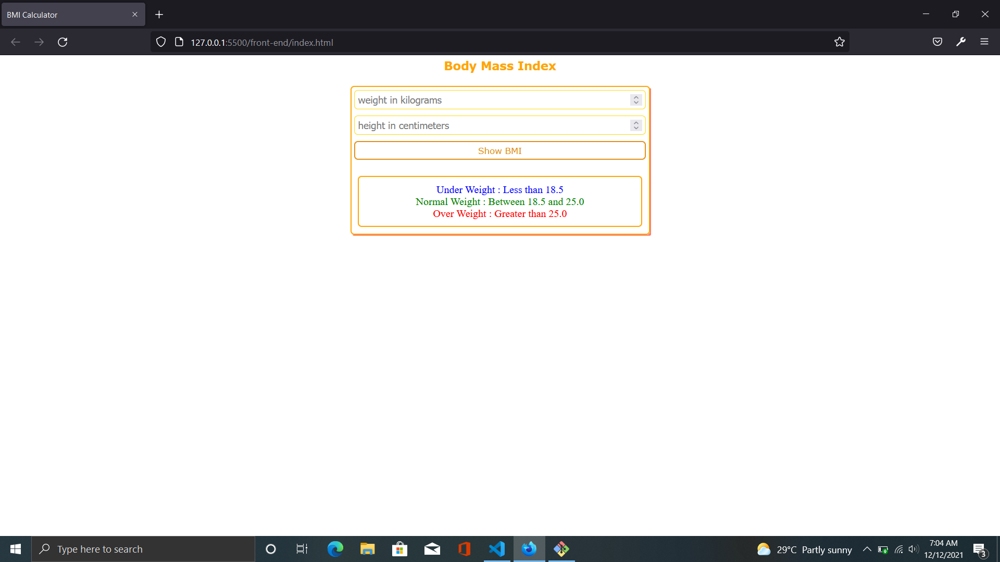
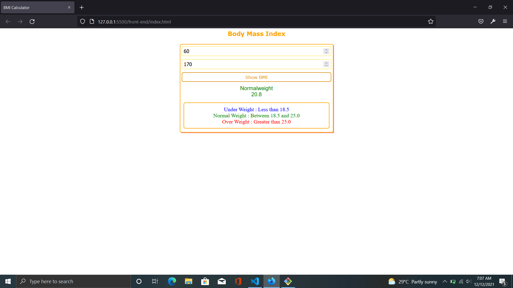
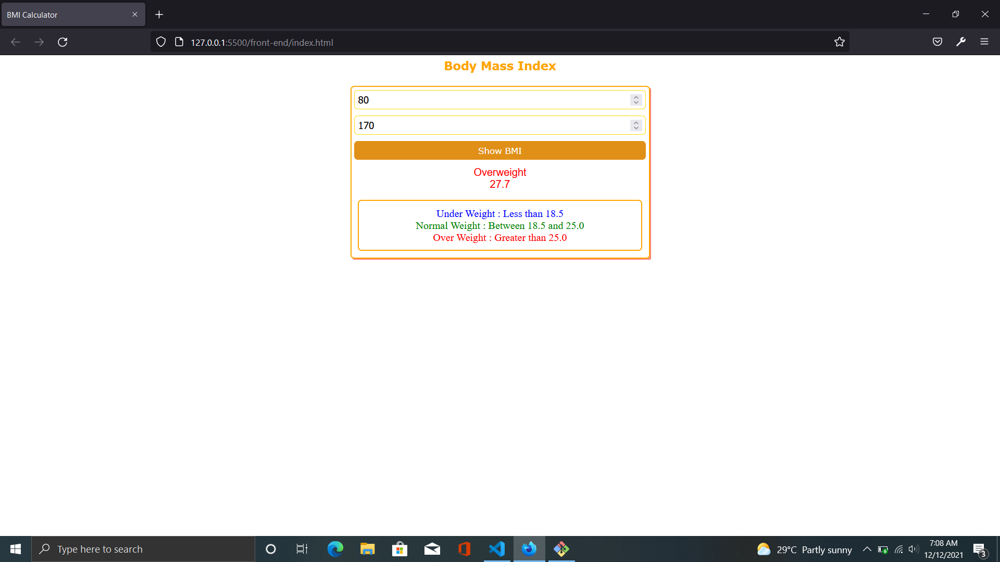
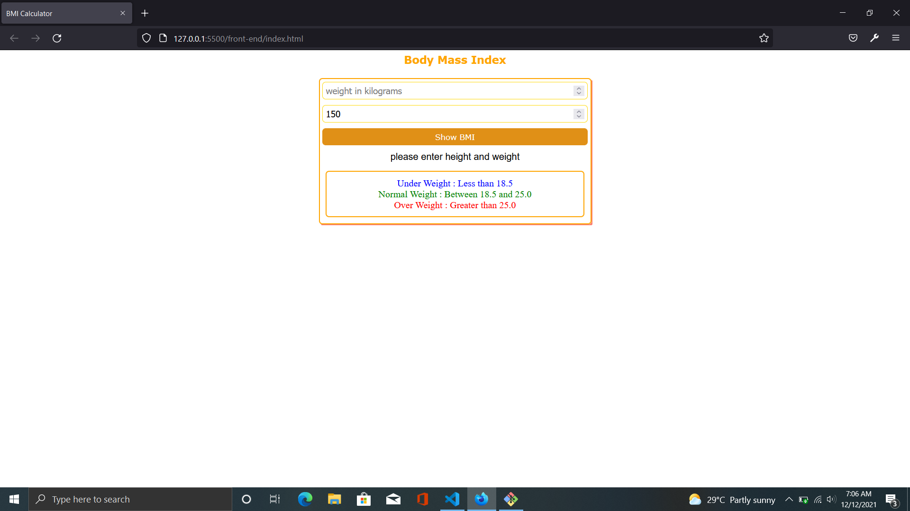
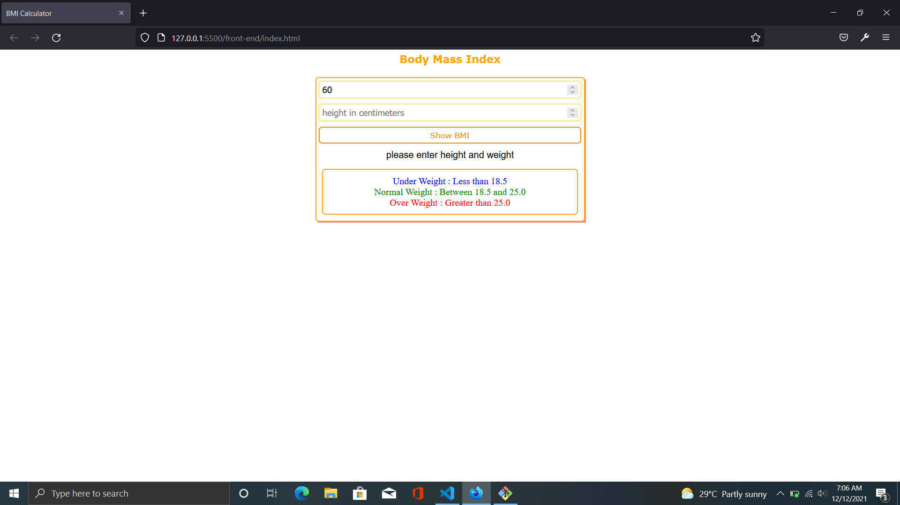
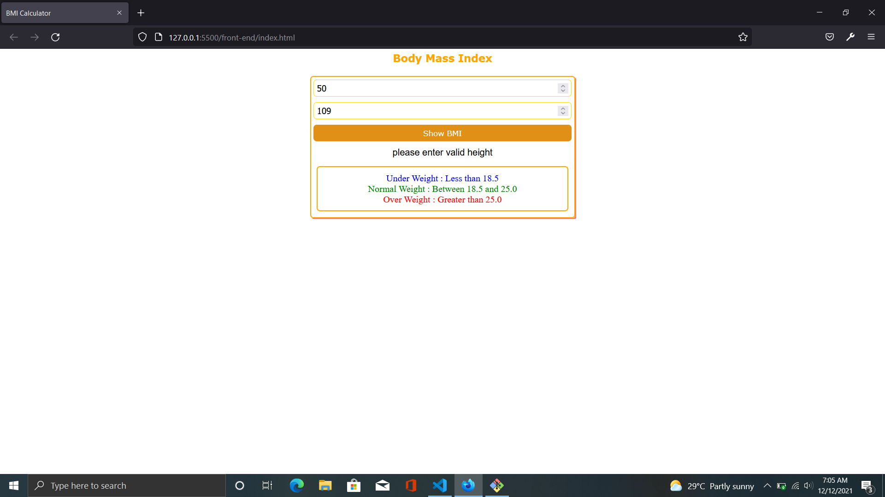

# BMI - Calculator

## Setup

### Backend Setup

Install yarn if you don't have yarn in your machine

`npm install -g yarn`

Clone the repository and navigate to back-end directory in your cmd/terminal

`cd back-end`

Install the dependencies by running the following commad

`yarn`

Run the development server by using the following command

`yarn dev`

Test the endpoints

GET 
- status code 
    - 200 

POST 
- status codes 
    - 200 on valid submission
    - 400 on invalid submissions
- examples
    - # Valid submissions 
    
    - `{ 
        "weight":30,
        "height": 110
    }`

    - `{ 
        "weight":60,
        "height": 170
    }`

    - # Invalid submissions 
    
    - height must be greater then 110 cm
        - `{ 
            "weight":60,
            "height": 100
        }`

    - request must have weight
        - `{ 
            "height": 170
        }`
    - request must have height
        - `{ 
            "weight": 50
        }`
 
### Frontend Setup

Open a new terminal/cmd (do not close the terminal already running the development server)

Navigate to front-end directory

`cd front-end`

Run the command to transpile the typescript code into javascript code()

`tsc`

Open the front-end/index.html with live server(preferably in VS Code)

Now you can see the Body Mass Index application in your browser

The outputs for Valid requests are as follows

The outputs for Invalid requests are as follows

